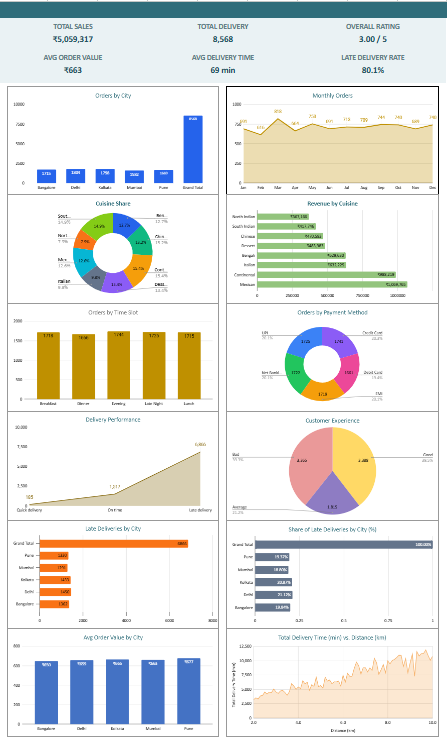

# 🍽️ Food Delivery Analysis — Google Sheets Dashboard

An end-to-end analysis of **8,568 food delivery orders** across **5 Indian cities (2015–2020)**, built in Google Sheets. The project covers data preparation with lookups, pivot-table analysis, an interactive KPI dashboard with 12 charts, and a regression analysis of what drives delivery time.

🔗 **[View the live spreadsheet](https://docs.google.com/spreadsheets/d/1SgRyEL5y3HWO1whouk4umbfAoH79tBNjHVHrbqaCji4/edit?usp=sharing)** (view-only)

## 📈 Food Delivery Performance Dashboard



---

## 📌 Business Questions

1. Where do orders and revenue come from: which cities, cuisines, time slots and payment methods?
2. How is the platform performing on delivery speed and customer satisfaction?
3. **Why are ~80% of deliveries marked late: an operational failure, or something else?**

---

## 📊 KPI Summary

| Total Sales | Total Deliveries | Overall Rating | Avg Order Value | Avg Delivery Time | Late Delivery Rate |
|:---:|:---:|:---:|:---:|:---:|:---:|
| **₹50,59,317** | **8,568** | **3.00 / 5** | **₹663** | **69 min** | **80.1%** |

> Total Sales is what customers paid (after discount, including delivery fee). Avg Order Value is the menu value before discount; the average amount actually paid per order is ₹590.

---

## 🖥️ Dashboard Walkthrough

The **Food Delivery Performance Dashboard** has 6 KPI cards and 12 charts, arranged in pairs:

| # | Chart | Type | What it shows |
|---|---|---|---|
| 1 | Orders by City | Column | Delhi (1,804) and Kolkata (1,798) lead; Mumbai is lowest (1,582) |
| 2 | Monthly Orders | Area | Orders are steady at ~620–820 per month, peaking in March (818) |
| 3 | Cuisine Share | Donut | Continental (15.4%) and South Indian (14.9%) are the most ordered |
| 4 | Revenue by Cuisine | Bar | Mexican (₹10.7L) and Continental (₹9.9L) earn the most |
| 5 | Orders by Time Slot | Column | Demand is flat across all 5 slots (~1,670–1,745 each) |
| 6 | Orders by Payment Method | Donut | All 5 methods are close to 20% each |
| 7 | Delivery Performance | Area | 6,866 late vs 1,517 on time vs 185 quick |
| 8 | Customer Experience | Pie | Good 39.5%, Bad 39.3%, Average 21.2% |
| 9 | Late Deliveries by City | Bar | Late count per city follows order volume |
| 10 | Share of Late Deliveries by City | Bar | Each city contributes 19–21% of all late orders |
| 11 | Avg Order Value by City | Column | Pune is highest (₹677), Bangalore lowest (₹650) |
| 12 | Delivery Time vs Distance | Area | Delivery time climbs steadily as distance grows |

---

## 🗂️ Dataset

Each row is one order, with 21 columns assembled from lookup tables for cities, customers, dishes, cuisines, ratings, discounts, delivery times and distances.

| Field group | Columns |
|---|---|
| Order | Order ID, Order Date, Slot, Customer ID |
| Location | Area Code, City, Distance (km) |
| Food | Dish Code, Cuisine |
| Money | Order Value, Discount (%), Final Price, Delivery Fee, Customer Payable |
| Outcome | Delivery Time (min), Rating (1–5), Experience, Speed |

**Derived fields**
- **Final Price** = Order Value × (1 − Discount %)
- **Customer Payable** = Final Price + Delivery Fee
- **Experience**: Good (rating 4–5), Average (3), Bad (1–2)
- **Speed**: Quick (< 30 min), On time (30–45 min), Late (> 45 min)

---

## 🛠️ Approach

1. **Data preparation**: merged the lookup tables into one order-level table with lookup formulas.
2. **Feature engineering**: calculated final price, customer payable, experience and speed categories.
3. **Pivot analysis**: summarised by city, cuisine, month, slot, payment method, speed and experience.
4. **Statistical analysis**: correlation and linear regression of delivery time on distance.
5. **Dashboard**: KPI cards and charts linked by live formulas to the data sheet.

---

## 🔍 Key Findings

### 1. Distance is the main driver of delivery time
| Statistic | Value |
|---|---|
| Correlation (r) | 0.85 |
| R² | 71.7% |
| Each extra km adds | +9.1 min |
| Base time (0 km) | 14.6 min |

| Distance band | Avg delivery time | Orders |
|---|---|---|
| 2–4 km | 41.4 min | 2,139 |
| 4–6 km | 59.2 min | 2,024 |
| 6–8 km | 77.3 min | 2,164 |
| 8–10 km | 96.4 min | 2,241 |

### 2. The 80% late rate comes mainly from the 45-minute threshold
- The regression line crosses 45 minutes at about **3.3 km**, but the **average order travels 6 km**, so most orders are expected to be late.
- The late rate is nearly identical in every city, which points to a system-wide cause rather than a local operations problem:

| City | Orders | Late | Late rate |
|---|---|---|---|
| Bangalore | 1,715 | 1,362 | 79.4% |
| Delhi | 1,804 | 1,450 | 80.4% |
| Kolkata | 1,798 | 1,433 | 79.7% |
| Mumbai | 1,582 | 1,291 | 81.6% |
| Pune | 1,669 | 1,330 | 79.7% |

### 3. Mexican leads revenue; Continental leads volume
- Continental has the most orders (1,323), but Mexican earns the most revenue (₹10.7L, 21% of sales) because of its higher price per order.
- North Indian is last on both orders (680) and revenue (₹3.7L).

### 4. Customer ratings are polarised
- About 4 in 10 customers rate Good and another 4 in 10 rate Bad, with only 2 in 10 in the middle.

### 5. Demand is evenly spread
- Time slots and payment methods each take roughly 20% of orders, and monthly volume is stable, so no single slot or channel dominates.

### 6. Delivery fees are small and distance-based
- The fee is ₹0 up to about 4 km, then roughly ₹10 per extra km, and makes up only **3.8%** of total sales.

---

## 💡 Recommendations

1. **Set distance-based delivery targets.** A flat 45-minute target labels most long-distance orders late by default. Promised times that scale with distance would measure performance fairly.
2. **Review the delivery radius** or add faster dispatch for orders beyond ~6 km, where average times exceed 60 minutes.
3. **Promote high-value cuisines** such as Mexican and Continental, and investigate why North Indian underperforms.

---

## 🚀 Next Steps

- Compare ratings across delivery-speed categories to test whether late orders actually get lower ratings.
- Replace the combined 12-month view with a year-over-year monthly trend.
- Rebuild the dashboard in Power BI with slicers for city, cuisine and year.

---

## 🧰 Tools & Skills

**Google Sheets**: lookup formulas, pivot tables, conditional logic, charts, KPI dashboard design
**Statistics**: correlation, linear regression, R²
**Analysis**: data cleaning, feature engineering, business storytelling

---

## 📁 Repository Structure

```
food-delivery-analysis/
├── README.md
├── data/
│   └── food_delivery_orders.csv
├── dashboard/
│   └── food_delivery_dashboard.xlsx
└── images/
    └── FoodDelivery.png
```

---

👤 **Rakesh**, aspiring Data Analyst
[LinkedIn](#) · [GitHub](#)
